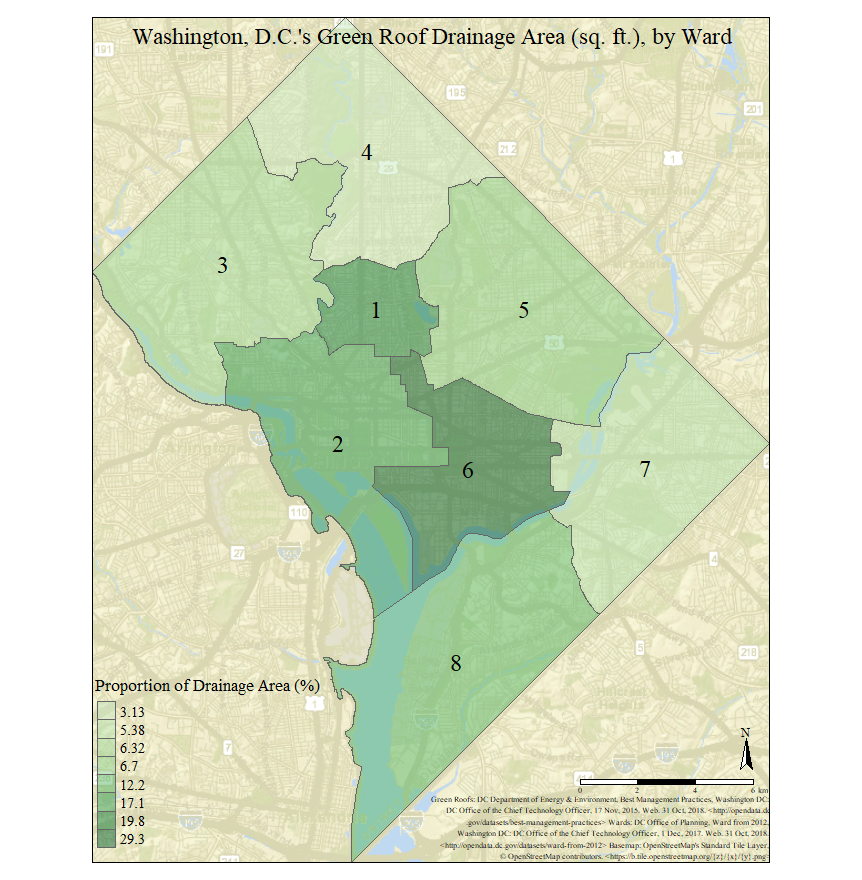

Words: 596

	An attempt was made to produce identical choropleths of the green roof (GR) drainage area in Washington, DC in QGIS and R. This allows for direct comparison of the processes used and choropleths developed, especially since the workflows used to produce the maps were practically the same. The individual green roofs are extracted from “Best Management Practices” (“BMP”) data and spatially joined with corresponding ward numbers from “Wards from 2012” (“Wards”) data. The sums of contributing GR drainage area by ward are merged back into the polygonal ward dataset, and then a new field capturing the proportion of total GR drainage area in each ward is created. Finally, this statistic is visualized via the two choropleths, both of which make use of OpenStreetMap basemaps. 
	Someone with little programming experience may feel that R is daunting and QGIS is more intuitive to use, but both have their strengths and weaknesses. R seems better suited for statistical analysis, and handling larger datasets appears to computationally cheaper. Combining this power with a plethora of opensource packages, R, and command-line generators in general, are undoubtedly superior at handling raw data; however, their command-line nature means that the user may have to wait until the end of production (or must keep running the same lines of code) to visualize the piece. Additionally, certain features (fonts, scale-bar units, etc.) may not be as complete or customizable as GUI mappers. In contrast, QGIS’s drag-and-drop GUI is much more interactive and provides immediate gratification and visualization. The included geoprocessing tools and available plug-ins in bolster its GUI strengths, allowing the user to see data transformations in real time. The major drawback of GUIs is that freedom seems to be limited by the available buttons, and while this is not always the case with opensource programs, packages and add-ons seem to have more hiccups than those available for command-line software. 
	The choropleths produced rely on “Wards” data and “BMP” data, which were compiled by many of DC’s offices. An issue with the “BMP” data is that they were compiled in 2015 and are likely missing recent GR installations. Likewise, there are many seemingly redundant fields for the “BMP” and the metadata do a poor job at describing the data. An OpenStreetMap basemap was also added give context. This was notably easier in R than in QGIS, given QGIS’s tendency of not reading some tile files. However, the final QGIS product is much more visually appealing than that of R. This is mainly because of the contextual second map and presence of a standalone legend, which direct the eye around the page, as opposed to centering it on the middle of the image, as the R choropleth does. While both maps are projected via long-lat with a WGS84 datum and ellipsoid, the R map appears to preserve relative area better. Convention dictates that a choropleth of green roof area should be represented by varying shades of green, however for the color-blind this meaning is lost. Nonetheless, because the choropleths are overlaid on the OSM basemaps, which distinguish between the areas of focus and context, the map is hopefully still readable. Overall, the projections could be altered so that both choropleths appear the same and so that area is the trait best preserved. Likewise, the final R product looks less complete (basic font, awkward citations position, etc.). Even though they are not perfect, the choropleths serve their purpose: to show that wards 1, 2, and 6 contain a disproportionate GR drainage area, relative to their overall size.


```{r echo=FALSE, fig.height=4, fig.width=3}
knitr::include_graphics("assessment01QGISMap.png")

```

```{r echo=FALSE, fig.height=8.5, fig.width=3}

```

